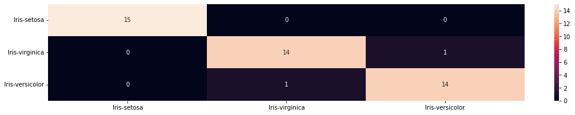

<div align=right style=display:inline-block>


</div>

<h1 align=center>Algoritmo Naive Bayes 🌷</h1>

### Ferramentas:
* Python 3

**Tier:** Básico ⭐⭐

### Objetivo:
Construir e analisar a eficácia de um modelo de machine learning utilizando bibliotecas de aprendizado de máquina, estatística e visualização de dados com o dataset Iris.csv.

### User Storie:

-   [ ] Como cientista de dados, quero avaliar o desempenho do modelo de machine learning utilizando o algoritmo naive bayes.

### Definition of Done:

-   [ ] Utilizar o algoritmo naive bayes.
-   [ ] Utilizar alguma métrica de avaliação do modelo.
-   [ ] Apresentar boa acurácia.


## 📋 Sumário
- [Fundamentos Teóricos](#fundamentos-teóricos)
- [O Algoritmo Naive Bayes](#o-algoritmo-naive-bayes)
  - [O Termo "Naive" (Ingênuo)](#o-termo-naive-ingênuo)
  - [O Truque do Logaritmo (Log Trick)](#o-truque-do-logaritmo-log-trick)
- [Tratamento de Problemas e Suavização de Laplace](#tratamento-de-problemas-e-suavização-de-laplace)
 - [Solução: Suavização de Laplace (Laplace Smoothing)](#solucao-suavização-de-laplace-laplace-smoothing)
- [Variações do Modelo](#variações-do-modelo)
- [Combinação de Atributos Diferentes](#combinação-de-atributos-diferentes)
- [Computação Distribuída](#computação-distribuída)
- [Projeto](#projeto)
 - [Sobre](#sobre)
 - [Como instalar](#como-instalar)
 - [Resultados](#resultados)
 - [Links úteis](#links-úteis)


## 🧠 Fundamentos Teóricos

O Naive Bayes é fundamentado em conceitos de probabilidade condicional e na **Regra de Bayes**:

* **Probabilidade a Priori (ou Incondicional):** Reflete a probabilidade de uma proposição ocorrer na ausência de qualquer outra informação. Pode-se pensar como a chance de algo acontecer antes de ter qualquer pista ou informação nova sobre o caso. Como um palpite inicial baseado puramente no histórico geral. Por exemplo, qual é a chance de chover hoje, no geral, olhando apenas as estatísticas do ano passado?  
* **Probabilidade Condicional:** Trata-se da probabilidade de um evento ocorrer dado que outro evento já aconteceu. É quando uma informação nova entra em cena e muda a chance de um evento acontecer. A pergunta agora passa a ser: "Qual é a chance de A acontecer, sabendo que B já aconteceu?". É descrita matematicamente pela fórmula:

$$P(a|b) = \frac{P(a \wedge b)}{P(b)}$$

  O cálculo matemático $P(a|b)$ simplesmente pega a chance de as duas coisas acontecerem juntas e divide pelo peso da pista que já tem em mãos $P(b)$. Por exemplo: a chance de você ter uma cárie é uma, mas se você já está sentindo uma dor de dente (sua pista), a chance de ser uma cárie aumenta muito.  
* **Regra de Bayes:** É a base dos sistemas modernos de inferência probabilística. Funciona como uma máquina de atualizar certezas. Ela nos ensina a recalcular a chance de algo ser real (a causa) a partir dos sinais ou pistas que estamos vendo (o efeito). A fórmula matemática apenas cruza três coisas básicas: a chance da pista aparecer se a causa for real (verossimilhança), o palpite inicial sobre a causa (a priori) e o peso geral dessa pista existir sozinha (evidência). Serve para responder perguntas como: "Se o paciente está com o pescoço rígido (efeito), qual é a chance real de ser torcicolo (causa)?". Relaciona as probabilidades condicionais e a priori da seguinte forma:

$$P(Y|X) = \frac{P(X|Y)P(Y)}{P(X)}$$

  Onde:  
  * $P(Y|X)$ é a probabilidade **Posteriori**.  
  * $P(X|Y)$ é a **Verossimilhança** (*Likelihood*).  
  * $P(Y)$ é a probabilidade **A Priori** (*Priori*).  
  * $P(X)$ é a **Evidência** (que funciona como um denominador constante e não depende das classes).  


## 🤖 O Algoritmo Naive Bayes

Para realizar a classificação de um objeto composto por $n$ características (variáveis independentes), denotado por $x = (x_1, ..., x_n)$, calcula-se a probabilidade desse objeto pertencer a uma classe específica $C_k$:

$$P(C_k|x_1, ..., x_n) \propto P(C_k) \prod_{i=1}^{n} P(x_i|C_k)$$

O classificador Bayesiano combina esse modelo probabilístico com uma regra de decisão (como o *argmax*) para definir qual classe é a preferida entre as hipóteses testadas:

$$\hat{y} = \arg\max_{k \in [1, ..., K]} P(C_k) \prod_{i=1}^{n} P(x_i|C_k)$$

1. A primeira fórmula: Calculando as chances de cada suspeita  

$$P(C_k|x_1, ..., x_n) \propto P(C_k) \prod_{i=1}^{n} P(x_i|C_k)$$

O que ela significa de forma simples:

Esta fórmula serve para calcular a "nota final" (a probabilidade) de o paciente ter uma doença específica, a classe $C_k$, com base nos sintomas que ele está apresentando (as características $x_1, ..., x_n$).

Para chegar nessa nota, o algoritmo faz uma multiplicação simples: ele pega a chance geral daquela doença existir no mundo, a probabilidade a priori $P(C_k)$, e multiplica pela chance de cada um dos sintomas aparecer em alguém que realmente tem essa doença $\prod P(x_i|C_k)$.

O símbolo $\propto$ significa apenas "proporcional a", o que na prática quer dizer: "não precisamos calcular a conta inteira com o denominador porque ele é igual para todas as doenças, então focar só na parte de cima já resolve o nosso problema".

2. A segunda fórmula: O Martelo da Decisão (O argmax)

$$\hat{y} = \arg\max_{k \in [1, ..., K]} P(C_k) \prod_{i=1}^{n} P(x_i|C_k)$$

O que ela significa de forma simples:

Depois que você usou a primeira fórmula e calculou a "nota final" para todas as doenças possíveis (Gripe, Dengue, Covid, etc.), você precisa tomar uma decisão e dar o diagnóstico final $\hat{y}$.

É aí que entra o argmax: "olhe para todas as notas que calculamos e escolha a maior de todas". O 
$k \in [1, ..., K]$ significa olhar a lista de todas as opções de doenças disponíveis e 
$\arg\max$ é a ordem para o sistema: "Certo, a Gripe deu nota 0.15, a Dengue deu 0.75 e a Covid deu 0.10. O maior argumento (a maior nota) é 0.75, então o diagnóstico final $\hat{y}$ é Dengue!".  

### O Termo "Naive" (Ingênuo)
O algoritmo é chamado de "ingênuo" porque ele assume uma **independência condicional absoluta** entre todos os atributos do objeto dado a classe. Embora essa suposição raramente seja puramente verdadeira na realidade, ela traz uma enorme vantagem computacional: reduz a complexidade do sistema de ordem exponencial $O(2^n)$ para ordem linear $O(n)$.

Imagine que está tentando adivinhar se uma pessoa é um jogador profissional de basquete. O algoritmo olha para duas pistas: ela tem 2 metros de altura e ela calça tamanho 45.

O algoritmo é chamado de "ingênuo" porque ele assume que essas duas pistas são 100% independentes uma da outra. Para ele, ter 2 metros de altura não influencia em nada o tamanho do pé.   

Fazer essa "vista grossa" economiza um trabalho computacional gigantesco. Em vez de o computador ter que calcular uma teia de relações que cresce de forma explosiva a cada nova pista, ele calcula cada pista individualmente em uma fila simples.

### O Truque do Logaritmo (Log Trick)
Multiplicar múltiplos valores decimais pequenos (probabilidades abaixo de 0) pode causar instabilidade computacional por subfluxo (*underflow*). Para mitigar esse problema, aplica-se o truque do logaritmo, transformando as multiplicações em somas de logaritmos:

$$\log(P(C_k)) \prod_{i=1}^{n} \log(P(x_i|C_k))$$

Na matemática, probabilidades são números decimais pequenos, sempre entre 0 e 1 (como 0,02 ou 0,005). O Naive Bayes multiplica todas as probabilidades das pistas para dar o veredito final.

Tentar multiplicar 0,002 por 0,01 e depois por 0,003... o resultado vai virar um número com tantos zeros depois da vírgula que o computador começa a se perder e pode acabar arredondando tudo para zero por pura limitação técnica (isso é o chamado underflow ou subfluxo).  

Para resolver isso, o algoritmo aplica uma transformação matemática chamada Logaritmo. A propriedade mágica do logaritmo transforma multiplicações em somas. Em vez de fazer o computador multiplicar várias frações minúsculas e perigosas, ele passa a somar os equivalentes dessas probabilidades. O resultado final é exatamente o mesmo, mas o computador faz a conta com total segurança e sem nenhuma chance de errar por causa de números pequenos demais.


## 🧼 Tratamento de Problemas e Suavização de Laplace

Se uma determinada categoria de atributo não possuir nenhuma entrada correspondente no conjunto de treinamento para uma classe, a sua probabilidade condicional resultante será zero ($0$). Como o algoritmo realiza uma produtória das probabilidades, basta uma única variável zerada para zerar toda a probabilidade posterior da classe.

Imagine que há um filtro de spam para e-mails. O algoritmo aprendeu tudo sobre e-mails normais e e-mails de spam lendo centenas de exemplos.

Agora, chega um e-mail com uma palavra nova. O algoritmo vai olhar no histórico e perceber que essa palavra específica nunca apareceu em nenhum e-mail de spam durante o treino. Logo, para ele, a chance dessa palavra estar em um spam é 0.

O Naive Bayes multiplica todas as pistas para dar a nota final da classe, se ele fizer a conta:

$$\text{Chance de Spam} = \text{Pista 1} \times \text{Pista 2} \times \text{Pista 3} \times \mathbf{0}$$

### Solução: Suavização de Laplace (Laplace Smoothing)
Para resolver isso, adiciona-se 1 ao numerador e soma-se o número total de atributos ($n$) mais 1 ao denominador na contagem das categorias vazias:

$$P(C|x) = \frac{\text{contagem}(x, C) + 1}{\text{contagem}(C) + n + 1}$$


## 📊 Variações do Modelo

Diferentes tipos de dados exigem diferentes distribuições de probabilidade para gerar o modelo preditivo:

| Modelo de NB | Tipo de Dado Suportado |
| :--- | :--- |
| **Bernoulli** | Dados Binários (Verdadeiro/Falso) |
| **Multinomial** | Dados Discretos (ex: contagens) |
| **Gaussian** | Dados Contínuos |


## 🔄 Combinação de Atributos Diferentes

Quando uma base de dados possui tipos mistos de atributos (variáveis contínuas e categóricas/discretas simultaneamente), existem duas abordagens principais para tratá-los:

* **Opção 1:** Dividir os atributos contínuos em faixas/intervalos (*bins*) e ajustar um modelo multinomial.

Em vez de dar ao algoritmo o valor exato do salário de cada pessoa (R$ 2.100, R$ 5.800, R$ 15.000), cria regras de conversão: 

De R$ 0 a R$ 3.000 $\rightarrow$ Vira a categoria "Salário Baixo"  
De R$ 3.001 a R$ 8.000 $\rightarrow$ Vira a categoria "Salário Médio"  
Acima de R$ 8.001 $\rightarrow$ Vira a categoria "Salário Alto"  


* **Opção 2:** Ajustar um modelo Gaussiano para os atributos contínuos e um modelo adequado para os categóricos, combinando-os posteriormente.

Ao calcular a chance de um cliente receber um cartão de crédito VIP.  
Para a Idade e o Salário (contínuos), o algoritmo usa um modelo Gaussiano (que usa médias e curvas matemáticas para entender dados numéricos fluidos).  
Para o Gênero e Histórico de Inadimplência (categóricos), ele usa um modelo adequado para categorias (como o Bernoulli ou Multinomial).  

O algoritmo calcula a probabilidade para os números de um lado, a probabilidade para as categorias do outro e, graças à regra de independência do Naive Bayes, ele simplesmente multiplica os resultados dessas duas partes para dar o veredito final.  


## ⚡ Computação Distribuída

Para lidar com grandes volumes de dados (*large datasets*), existem bibliotecas capazes de computar os modelos de Naive Bayes de forma paralela. 
* Elas utilizam parâmetros limitados e probabilidades logarítmicas como método de sumarização.
* O pacote `Scikit-Learn` possui implementações com "ajuste parcial" (*partial tuning* ou *partial_fit*) voltadas para cálculos fora da memória principal (*out-of-core*) executados em paralelo.

## 💻 Projeto

### Sobre

Este código é um modelo de machine learning que utiliza o algoritmo Naive Bayes, da biblioteca Scikit Learn. O modelo é um aprendizado supervisionado que utiliza como classificador o GaussianNB. Nesse tipo de aprendizagem, o algoritmo recebe os rótulos das amostras.  
A base de dados é divida em treino e teste e usa o conceito de cross-validation para dividir as amostras sem perder a quantidade de amostras por classe.  
Para medir a acurácia do modelo foi utilizada uma matriz de confusão, que apresenta os valores verdadeiros e preditos de uma classificação.  
A base de dados utilizada foi a Íris, que apresenta 3 espécies com os tamanhos das pétalas e o rótulo, e possui 150 amostras sendo 50 de cada classe. Os atributos das amostras são comprimento e largura da sépala e da pétala, as classes são Íris setosa, Íris virgínica e Íris versicolor.  
O algoritmo Naive Bayes utiliza a frequência das ocorrências em uma base de dados para prever uma variável de interesse e o classificador GaussianNB é indicado quando as variáveis independentes são contínuas e têm distribuição normal. Por exemplo tentar prever a espécie de Íris a partir de vários tamanhos das pétalas e sépalas.  

### Como instalar

Para esta etapa, deve ter o Python 3 instalado. Para instalar acesse o [link](https://python.org.br/instalacao-windows/).


- Clone o repositório:
``` bash
$ git clone https://github.com/StehMaria/Naive_Bayes
```
- Entre no diretório:
``` bash
$ cd Naive_Bayes
```

- Para instalar dependências:
``` bash
$ pip install -r requirements.txt
```

- Execute a aplicação:
``` bash
$ python naive_bayes.py
```

### Resultados



As amostras foram divididas em 70% para treino e 30% para teste. A análise da matriz de confusão para o conjunto de teste revelou os seguintes resultados: o modelo classificou corretamente 15 amostras de Íris setosa e 14 amostras de Íris virginica. Para a Íris versicolor, 14 amostras foram classificadas corretamente, enquanto 1 amostra foi erroneamente classificada como Íris virginica.
A acurácia geral do modelo foi de 0.955556, o que corresponde a aproximadamente 96%.  

### Links úteis

[Scikit Learn](https://scikit-learn.org/stable/)  
[Matplotlib](https://matplotlib.org)  
[Numpy](https://numpy.org)  
[Pandas](https://pandas.pydata.org)  
[Naive Bayes](https://scikit-learn.org/stable/modules/naive_bayes.html) 
